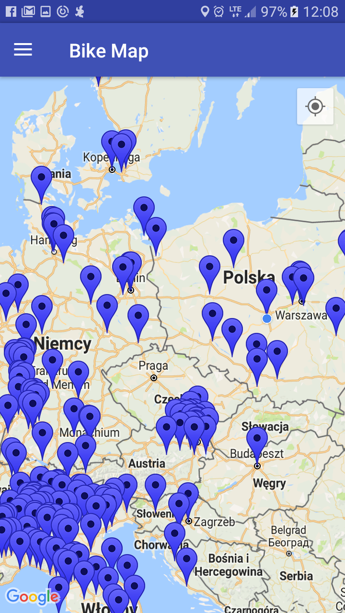
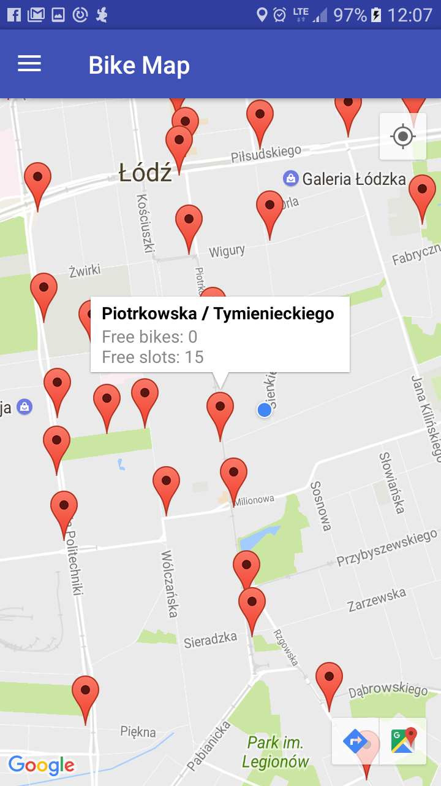
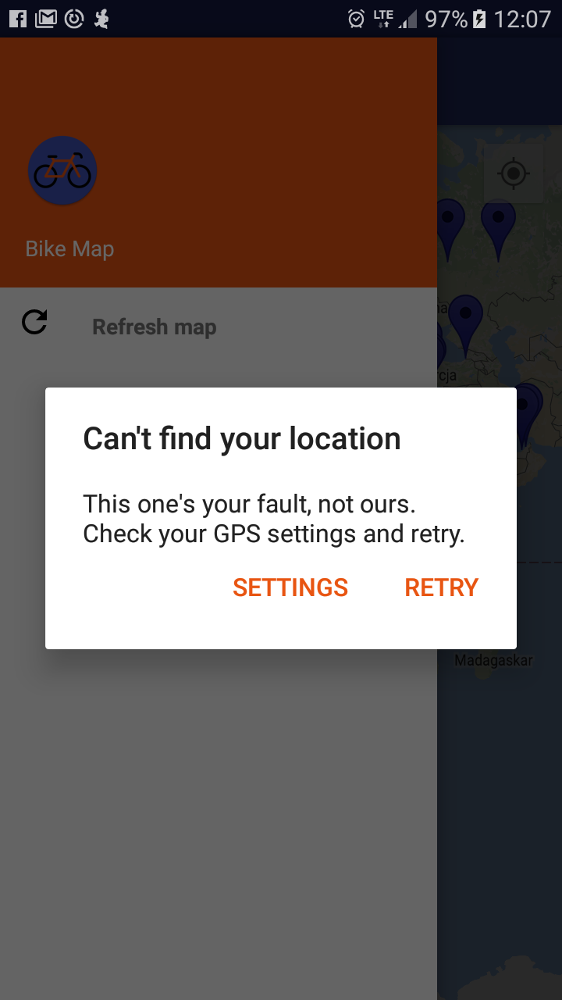
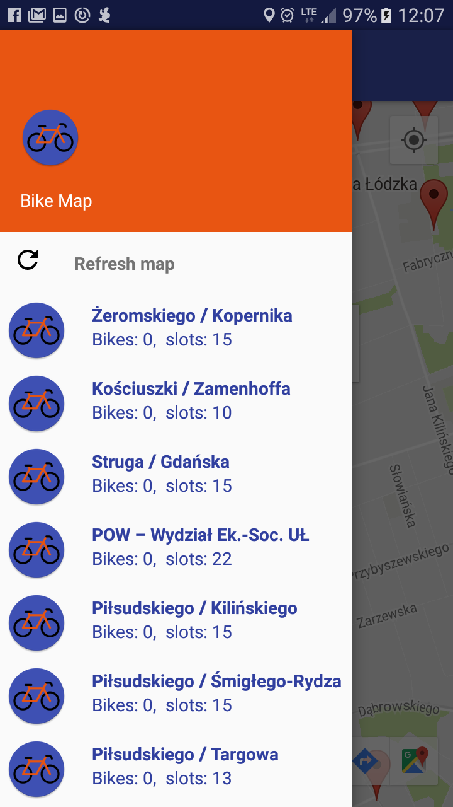

## Bike map

Android application is showing the nearest bike stations.

   

## License

Copyright 2017, MomoTheCat

Permission is hereby granted, free of charge, to any person obtaining a copy of this software and associated documentation files (the "Software"), to deal in the Software without restriction, including without limitation the rights to use, copy, modify, merge, publish, distribute, sublicense, and/or sell copies of the Software, and to permit persons to whom the Software is furnished to do so, subject to the following conditions:

The above copyright notice and this permission notice shall be included in all copies or substantial portions of the Software.

THE SOFTWARE IS PROVIDED "AS IS", WITHOUT WARRANTY OF ANY KIND, EXPRESS OR IMPLIED, INCLUDING BUT NOT LIMITED TO THE WARRANTIES OF MERCHANTABILITY, FITNESS FOR A PARTICULAR PURPOSE AND NONINFRINGEMENT. IN NO EVENT SHALL THE AUTHORS OR COPYRIGHT HOLDERS BE LIABLE FOR ANY CLAIM, DAMAGES OR OTHER LIABILITY, WHETHER IN AN ACTION OF CONTRACT, TORT OR OTHERWISE, ARISING FROM, OUT OF OR IN CONNECTION WITH THE SOFTWARE OR THE USE OR OTHER DEALINGS IN THE SOFTWARE.

## Additional
This app use CityBikes API: https://api.citybik.es/v2/

Icons made by <a href="http://www.freepik.com" title="Freepik">Freepik</a> from <a href="http://www.flaticon.com" title="Flaticon">www.flaticon.com</a> is licensed by <a href="http://creativecommons.org/licenses/by/3.0/" title="Creative Commons BY 3.0" target="_blank">CC 3.0 BY</a>

## Opis

### Wprowadzenie
Niniejszy projekt został stworzony by ułatwić mieszkańcom miast, w których działa rower publiczny, poruszanie się po mieście. Jest to odpowiedz wolną i często nie odpowiadającą aplikację NEXT BIKE jak i również jej rozszerzenie. Ponadto, jest zaliczeniem projektu uczelnianego.

Jazda rowerem ma ogromne zalety w stosunku do poruszania się samochodami, gdyż nie wydzialają związków toksycznych, które co roku są przyczyną wielu zgonów [1]. W krajach takich jak Dania rowery można spotkać na ulicy o każdej porze roku, niezależnie od tego czy pada deszcz/śnieg czy też świeci słońce. W mieście w którym zostałą napsiana niniejsza aplikacja, w Łodzi, z roku na rok przybywa rowerów, a osoby jeżdżące samochodami coraz częściej przesiadają się na transport publiczny jak i rowery(!). Ponadto jazda rowerem to nie tlyko przemieszczanie się z punktu A do punktu B, ale również forma ćwiczeń na które czasem ciężko znaleźć czas.

Aplikacja pokazuje firmy obsługujące rowery publiczne na całym świecie, a dla najbliższej użytkownikowi lokalizacji pokazuje znajdujące się stacje rowerowe wraz z informacjami ile jest wolnych rowerów oraz miejsc na ich pozostawienie.

### Opis techniczny
Apliakcja zostałą stworzona zgodnie z dobrymi praktykami pisania w Androidzie. Oddzielone zostały moduły takie jak widok, kontroler oraz model. Ciągi znaków (ang. Strings) znajdują się w osobnym pliku, gotowym do przetłumaczenia na inny jezyk. Tematy oraz kolory mogę zostać zmienione za pomocą jednej linijki dzięki zastosowaniu plików XML.

Najważniejszym plikiem który znajduje się w proejkcie jest plik AndroidManifest.xml, zdefiniowane są w nim informacje dotyczące co musi zostać wykonane przed uruchomieniem samej apliakcji oraz inforamcje takie jak m.in. znajdujące się Activity, pozwolenia (permisssions) na używanie danych modułów oraz klucze dostępu.

#### Komponenty
Apliakcja jedno Activity (MainActivity zdefiniowane w pliku AndroidManifest.xml), Fragment (GmapFragment) dziłajacy pod Activity, który łaczy się z mapą google oraz GoooleAPI w celu ustalenia ustalenia lokalizacji użytkownika. Stacje rowerowe reprezentowane są przez markery pokazywane na mapie, niebieskie dla firm, by mieć poglad w jakich miejscach na świecie znajduje się ‘rower publiczny’, a czerwone reprezentujace stacje rowerowe, na których można dokonać wypożyczenia roweru.

Komponentami dodatowymi są NavigationDrawer, na którym znajdują się przycisk odświeżenia mapy oraz ToolBar, który ułatwia w otwieraniu NavigationDrower’a.
Sam NavigationDrawer posiada zaimplementowany RecyclerView, który jest zaawansowaną listą która wyświetla stacje rowerowe.

#### Wymagania
Aby apliakcja działała poprawnie, telefon powinien posiadać Androida w wersji 4.4 (KitKat, api 19) lub powyżej, co spełnia obecnie prawie 87% użądzeń z Androidem na pokładzie [2].

Telefon powinien być podłaczony do Internatu oraz meić włączoną lokalizację. Gdy jedną, bądz obie funkcje nie są włączone przed uruchomieniem apliakcji, wyświetli ona okienko (AlertDialog) proszące o włączenie danej funkcjonalności.

#### Jak działa
Aplikacja po włączeniu przekazuje widok do Fragmentu, który wyśweitla mapę a jednoczesnie w tle pobiera lokalizację użytkownika (dzięki GoogleAPI) oraz pobiera asynchronicznie dane o stacjach z internetu używając biblioteki Volley. Początkowo wszystkie firmy, a po ustaleniu pozycji użytkownika wysyłąne jest drugie zapytanie o konkretną firmę, które to zwraca informacje o stacjach rowerowych. Klikając w markera, użytkownik może zobaczyć ilosć dostępnych rowerów oraz wolnych miesjc na umieszczenie tam obecnie wypożyczonego roweru.

#### Wzorce projektowe
Najpopularniejszym wzorcem proejktowym w Androidzie jest MCV, które zostało zastosowane również w tej aplikacji. Model zdefiniowany jest Package – model. Widoki znajdują sie w folderze „res”, a kontroler to pozostałe klasy.

Builder, zapobiega tworzeniu wilu konstruktorów, został wykorzystany przy okazji tworzenia AlertDialog (w klasie MainActivity metoda showNetworkDialog oraz w klasie GMapFragment w metodzie showLocationDialog), przy okazji tworzenia markerów (GmapFragment, metoda updateMapWithStations oraz updateMapWithNetworks) oraz przy okazji tworzenia wielu innych obiektów.

Adapter, zaimplementoawany w klasie AdapterView.

Singleton, również w klasie AdapterView.

#### Testy
W aplikacji znajdują się dwa typy testów. Pierwszy to testy jednostkowe w katalogu app/src/test Testy te są dosyć skromne, ale napisane zgodnie z ideą, że należy testować tylko jeden fragment kodu (np. metodę) a pozostała część powinna zostać zaślepiona. Do tego celu wykorzystano Mockito. Aplikacja dosyć szeroko korzysta z funkcji wbudowanych w system operacyjny, co znacznie utrudnia przygotowanie testów jednostkowych.

Aby utrzymać wysoki poziom jakości aplikacji przygotowano testy UI które znajdują się w katalogu app/src/androidTest

Raport z pokrycia kodu testami znajduje się w catalog coverageReport.

#### Kompilacja
Aby poprawnie skompilować aplikację należy w lokalnym pliku gradle.properties zmienną GOOGLE_MAPS_API_KEY której wartoś należy ustawić na klucz do Google Map API.

####Pobieranie danych z Internetu
Dane pobierane są asynchronicznie z pomoca biblioteki Volley (klasa MapProcessorImpl), a następnie parsowane za pomocą Jackson’a (klasa JsonParser) na klasy znajdujące się w modelu. Jaskson nie wym,aga tworzenia konstruktorów ani posiadania setterów, dzięki temu klasy są małe i czytelne.

   

[1] https://www.theguardian.com/environment/2016/nov/23/uk-has-second-highest-number-of-deaths-from-no2-pollution-in-europe
[2] https://developer.android.com/about/dashboards/index.html
[3] https://developer.android.com/training/volley/index.html

